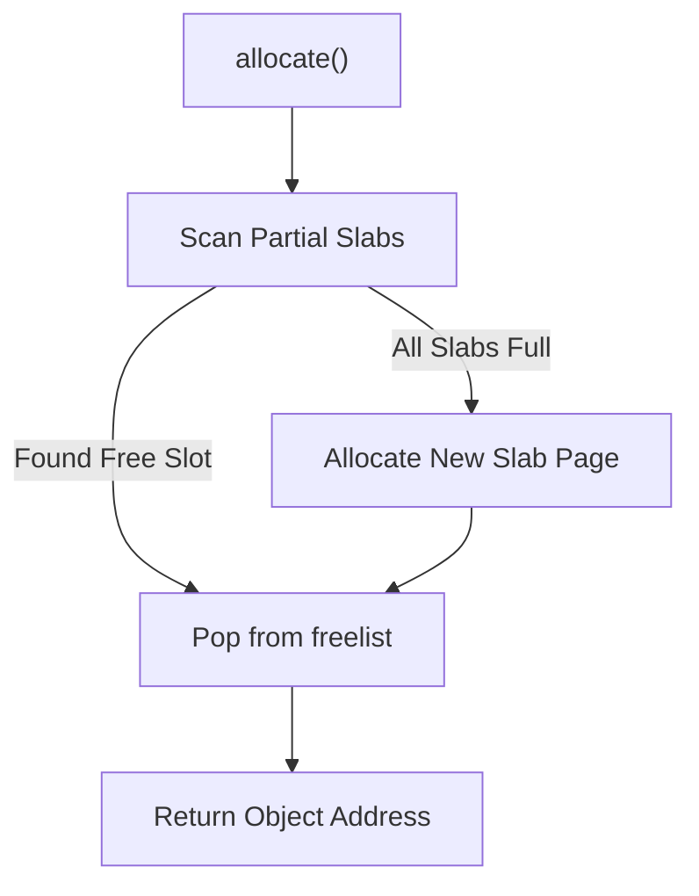

# Slab Allocator Kernel Memory Cache Skill

Robust, zero-dependency Python implementation of the **Slab Allocator** for high-efficiency fixed-size kernel object pooling.

## Features
- **Object Caching**: Eliminates internal fragmentation for uniform object sizes via freelists.
- **Dynamic Slab Growth**: Expands new slab backing stores on demand when capacity saturates.
- **Zero External Dependencies**: Pure Python standard library.
- **Native MCP Protocol**: JSON-RPC 2.0 stdio server compatible with Claude Desktop, Cursor, and Windsurf.

## Architecture

